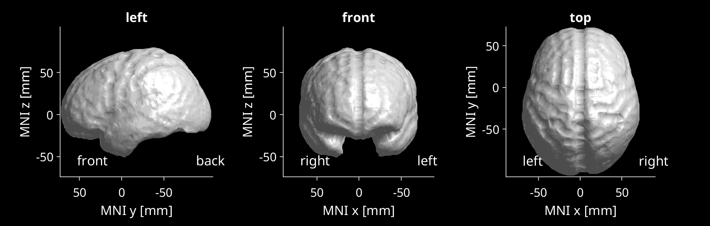
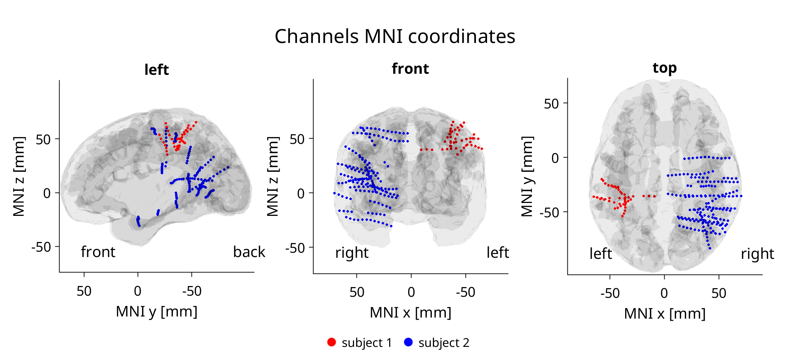
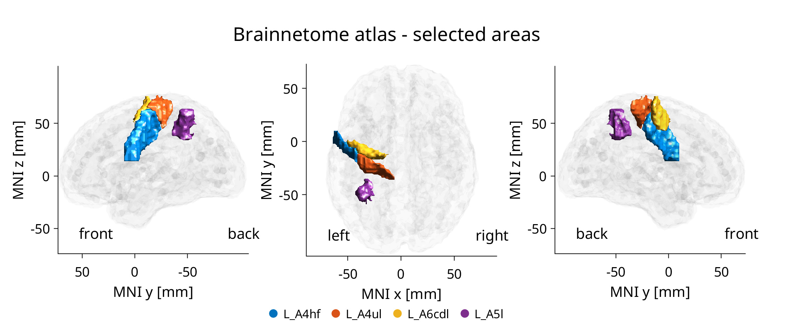
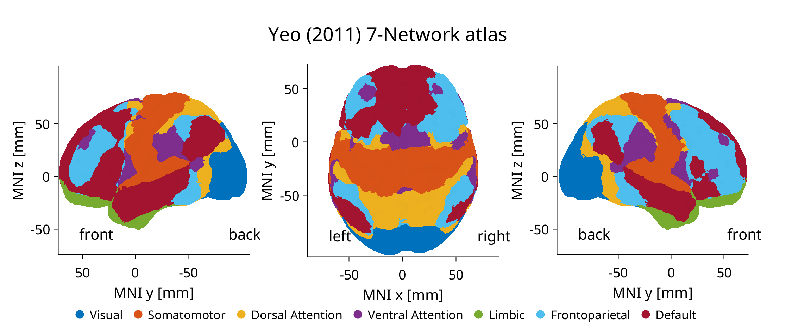
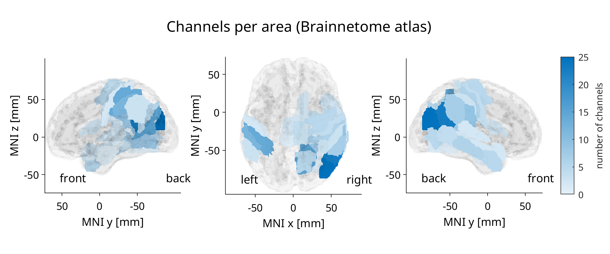
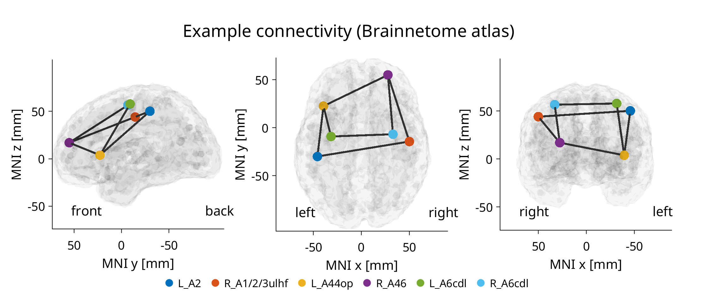

# brainPlotMNI

MATLAB library for 3D brain visualization and atlas-based analysis of iEEG data in MNI space. Covers the full workflow - loading [NIfTI](https://nifti.nimh.nih.gov/) atlas volumes, localizing electrode channels to anatomical areas, and producing publication-ready 3D renders of channel positions, labeled ROIs, and inter-regional connectivity. Example scripts included for every feature.




## Requirements

- **MATLAB** R2019b or later (uses `arguments` block syntax)
- [**Image Processing Toolbox**](https://www.mathworks.com/help/images/index.html) (for `niftiinfo` and `niftiread`)

## Installation

Clone the repository and add the `src/` folder to your MATLAB path:

```matlab
addpath('/path/to/brainPlotMNI/src');
```

The `+brainatlas` and `+brainvis` packages will be available on the path.

## Examples

**[example01_simpleBrain](examples/example01_simpleBrain.m)** - Basic brain envelope plot with the Colin27 template. *(see image above)*

**[example02_MNIchannels](examples/example02_MNIchannels.m)** - Channel coordinates from two subjects with per-subject colors.


**[example03_BrainnetomeAreas](examples/example03_BrainnetomeAreas.m)** - Selected left-hemisphere Brainnetome areas with distinct colors.


**[example04_YeoAtlas](examples/example04_YeoAtlas.m)** - All 7 Yeo resting-state networks with unique colors.


**[example05_channelsLocalization](examples/example05_channelsLocalization.m)** - Brainnetome areas colored by channel count per area.


**[example06_connectivity](examples/example06_connectivity.m)** - Inter- and intra-hemispheric connectivity between bilateral sensorimotor areas.



## Project Structure

```
brainPlotMNI/
├── src/                       # Library source (add this folder to path)
│   ├── +brainatlas/           # Atlas loading and MNI coordinate mapping
│   │   ├── loadAtlasVolume    Load a NIfTI atlas file
│   │   ├── loadAtlasLabels    Read and process atlas label CSV
│   │   ├── volume2MNI         Convert 3D volume to MNI coordinates
│   │   ├── importAtlasVolume  Load + convert in one step
│   │   ├── MNI2Atlas          Map channel MNI coords to atlas labels (numeric)
│   │   └── MNI2AtlasLabels    Map channel MNI coords to atlas labels (string)
│   └── +brainvis/             # 3D brain visualization
│       ├── BRAINplot          Base function: empty brain envelope with views
│       ├── MNIplot            Plot electrode points in MNI space
│       ├── AREAplot           Render atlas regions with user-defined colors
│       ├── AREAplotConnectivity  Add connectivity lines/edges between areas
│       └── addLegend          Helper for colored-dot legends
├── examples/                  # Runnable demo scripts
├── data/                      # Atlas and template files (.nii, .csv, .ctbl)
└── img/                       # README showcase images
```

## Functions

### `+brainatlas` - Data Loading & Coordinate Mapping

| Function | Description |
|---|---|
| `loadAtlasVolume(atlasPath)` | Load a `.nii` atlas and return the 3D volume array and affine transform matrix. |
| `loadAtlasLabels(csvPath)` | Read a label CSV and collapse left/right index columns into a single sorted table with laterality prefixes (L_/R_). |
| `volume2MNI(Volume, transform)` | Convert a labeled 3D volume to Nx3 MNI coordinates with corresponding label values. Filters out background voxels (configurable `ignoreVal`). |
| `importAtlasVolume(atlasPath)` | Convenience wrapper that combines `loadAtlasVolume` and `volume2MNI` into a single call. |
| `MNI2Atlas(channelsMNI, atlasMNI, labels, radiusInit)` | Assign atlas labels to channel coordinates using a spherical search with growing radius (up to `maxRadius`, default 10 mm). Returns the most probable label, distance to nearest labeled voxel, and optional probability distributions. |
| `MNI2AtlasLabels(channelsMNI, atlasMNI, labels, areasNumbers, areasLabels)` | Wraps `MNI2Atlas` to convert numeric labels to human-readable string labels with probability filtering. |

### `+brainvis` - 3D Visualization

| Function | Description |
|---|---|
| `BRAINplot(hfig, volumeMNI)` | Render an empty brain envelope (alphaShape) with configurable views (left/front/top), anatomical direction labels, and axis styling. Shared base for all other plot functions. |
| `MNIplot(hfig, volumeMNI, channelsMNI, colors)` | Plot channel/electrode points on the brain envelope with user-defined colors. |
| `AREAplot(hfig, volumeMNI, atlasLabels, areaIDs, colors)` | Render specific atlas regions as colored 3D patches on the brain surface. |
| `AREAplotConnectivity(hfig, volumeMNI, atlasLabels, areaIDs, connMatrix, colors)` | Extend `AREAplot` with connectivity edges between area centroids, with edge thickness/color reflecting connection strength. |
| `addLegend(names, colors)` | Create a horizontal legend with colored dot markers positioned at the bottom of the current axes. |

## Channel Localization

To assign an anatomical label to each iEEG electrode, `MNI2AtlasLabels` searches the atlas volume around each channel's MNI coordinate using a growing spherical radius. The most frequent atlas label found within the sphere is assigned, and the distance to the nearest voxel of that label is returned as a confidence metric (large distances suggest white matter or unlabeled regions).

The workflow is:

```matlab
% 1. Load an atlas (e.g. Brainnetome)
[Volume, transform] = brainatlas.loadAtlasVolume('data/BrainnetomeAtlas/BN_Atlas_246_1mm.nii');
[volumeMNI, volumeLabels] = brainatlas.volume2MNI(Volume, transform);

% 2. Load the label table (numeric IDs -> area names)
atlasLabelsTable = brainatlas.loadAtlasLabels('data/BrainnetomeAtlas/BN_Atlas_labels.csv');

% 3. Localize your channels (Nx3 MNI coordinates)
[chanLabels, chanDist, chanProbs] = brainatlas.MNI2AtlasLabels( ...
    channelsMNI, volumeMNI, volumeLabels, atlasLabelsTable.Index, atlasLabelsTable.Label);
```

The output `chanLabels` contains the most probable anatomical area name per channel, `chanDist` gives the distance to the nearest labeled voxel, and `chanProbs` provides a comma-separated breakdown of all label probabilities above 10%.

## Data

The repository includes the MNI152 brain template and the following atlases in NIfTI format, all registered to MNI space:

- **Brainnetome Atlas** - 246 sub-regions, structural + functional connectivity
- **Yeo 7/17 Networks** - 7 or 17 resting-state functional networks
- **Mars Atlas** - cortical parcellation based on macroanatomical landmarks ([*requires separate download*](https://meca-brain.org/software/marsatlas-colin27/))

other atlases can be added as long as they are provided as a `.nii` volume (ideally in MNI space) with a corresponding labels `.csv`. See [data/README.md](data/README.md) for more detail on brain templates and brain atlases, file descriptions and citations.

## License

MIT - see [LICENSE](LICENSE).
